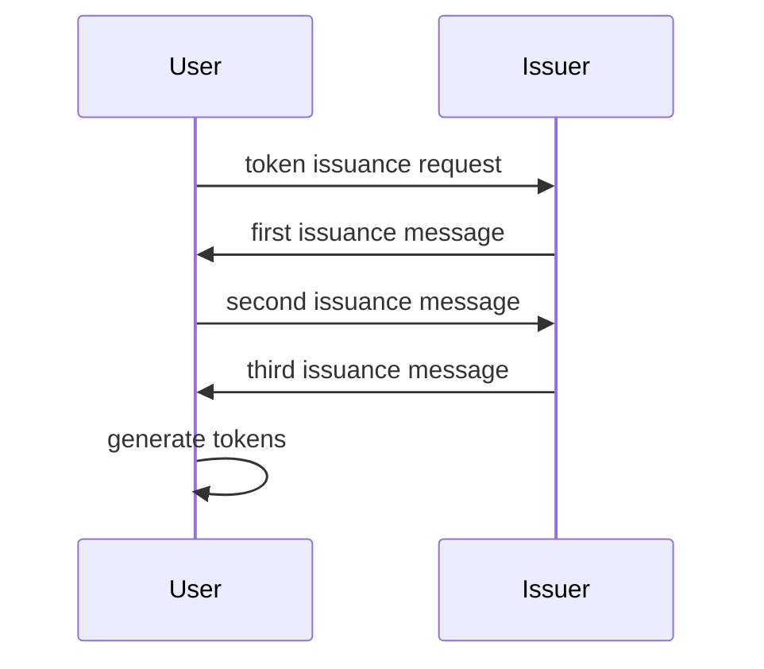

In this post, I'll give an overview of the recently released [U-Prove JSON Framework (UPJF)](https://github.com/microsoft/uprove-node-reference/blob/main/doc/U-Prove_JSON_Framework.md), which defines how to use JSON to encode U-Prove artifacts, allowing developers to easily integrate the privacy-protecting cryptographic technology into web applications.

# U-Prove Technology Overview

First things first, let's quickly review U-Prove: the cryptographic system that allows the issuance of signed tokens containing _selectively-disclosable_ attributes bound to a user key pair that can be presented in an _unlinkable_ manner. Let's break down what that means:
1. Attributes can be of any types; think of them as claims in the JSON Web Token (JWT) world. Only the attribute values are encoded in a U-Prove token, the types (and ordering) are specified in the issuer parameters.
2. Nothing in the token other than the encoded attributes can identify the user. In particular, the token's public key and signatures are randomized in the issuance protocol and are never seen by the issuer.[^1] The issuer can still recognize tokens it issued (as would any verifier), but can't determine in which issuance session they were created. As an analogy, imagine the issuer is a bank issuing dollar bills. All bills of the same denomination may look the same, but a withdrawal and spending can be linked on the basis of the bill's unique serial number; coins on the other hand all look alike and can't be distinguished.
3. The user can decide, at presentation time, which attributes to disclose to a verifier. Hidden attributes are perfectly hidden, they cannot be brute-forced. 

The issuer creates its key pair and publishes its public parameters (including its public key and details about the to-be-issued tokens). The [UPJF](https://github.com/microsoft/uprove-node-reference/blob/main/doc/U-Prove_JSON_Framework.md) only supports the pre-generated [recommended parameters](https://github.com/microsoft/uprove-node-reference/blob/main/doc/U-Prove%20Recommended%20Parameters%20Profile%20V1.1%20Revision%203.pdf) which use the NIST prime-order curves (P256, P384, P521) and the issuance of tokens with a maximum of 50 attributes.

Multiple tokens encoding the same attributes can be issued in parallel in a single issuance session; each will have a unique key pair and signature. Tokens can be presented to verifiers by signing a message (which could be a unique challenge for access scenarios, or some application-specific data for digital signature scenarios). Token can be presented once for anonymous interactions, or reused for pseudonymous ones. 

These core features are supported in the JSON profiles and implemented in the [Typescript node library](https://github.com/microsoft/uprove-node-reference), and are suitable for many web scenarios.[^2]

For more information, check out the [technology overview](https://github.com/microsoft/uprove-node-reference/blob/main/doc/U-Prove%20Technology%20Overview%20V1.1%20Revision%203.pdf) or if you feel adventurous, the [crypto specification](https://github.com/microsoft/uprove-node-reference/blob/main/doc/U-Prove%20Cryptographic%20Specification%20V1.1%20Revision%205.pdf) contains all the gory details. Note that the sample values used in the post were generated using the [JSONFrameworkSample](https://github.com/microsoft/uprove-node-reference/blob/main/samples/samples.ts) in the library.

# Issuer setup

The issuer first generates its parameters containing its public key, a description of which curve and generators to use, a unique identifier for the parameters, and an application-specific description of the tokens content. Here is an example of a JSON Web Key (JWK) object containing a set of issuer parameters:

```json
{
    "kty": "UP",
    "alg": "UP256",
    "kid": "a0A3quUdeEoIJT9R_-Ysy_kr7CTmJ2w9GSSZSHBvP3I",
    "g0": "BLaj8knVriRtGjLfGVg9MX1HvaPZDbhq0PmNcpxrA4oGZYoBPV-Nkcf0yfyI0mLMA10ykCj4DHKfol4T2D3HvsQ",
    "spec": "eyJuIjozLCJleHBUeXBlIjoiZGF5IiwiYXR0clR5cGVzIjpbIm5hbWUiLCJlbWFpbCIsIm92ZXItMjEiXX0"
}
```
 
* The key type `kty` is always set to "UP" for U-Prove.
* The curve and generators are identified by the `alg` identifier, which could be either "UP256", "UP384", or "UP521" (corresponding to the NIST P-256, P-384, and P-521, respectively, and the matching [pre-calculated generators](https://github.com/microsoft/uprove-node-reference/blob/main/doc/U-Prove%20Recommended%20Parameters%20Profile%20V1.1%20Revision%203.pdf)).
* The key identifier `kid` corresponds to the issuer parameters UID which needs to be unique for the application realm. Developers can simply let the library generate these as the hash digest of the other fields.
* `g0` is the issuer public key.
* The specification `spec` is a base64 encoding of a JSON object describing the content of to-be-issued tokens. Here, the value is:

```json
{
    "n":3,
    "expType":"day",
    "attrTypes":["name","email","over-21"]
}
```

specifying that tokens will have 3 (`n`) attributes of type (`attrTypes`) "name", "email", and "over-21" respectively (these should be normal JWT claim types), and that the token expiration values will be measured in days (`expType`).

The [UPJF](https://github.com/microsoft/uprove-node-reference/blob/main/doc/U-Prove_JSON_Framework.md) recommends expressing expiration dates in privacy-friendly buckets (hours, days, weeks, and years), to avoid introducing precise expiration dates that could be used to track and trace users; in this example, all expiration dates of tokens will be set to midnight after the specified number of days. We are taking great care to avoid introducing undesired correlatable values in U-Prove tokens that could break their unlinkability; this is why the issuer is committing to their structure in its parameters.[^3]

# Anatomy of a U-Prove token

U-Prove tokens have the following structure:

<div align='center'>
  <br/><br/>
</div>

* The values for the attributes 1 to `n` (given in the issuer parameters). The user will be able to decide which of these attributes to disclose to verifiers and which ones to hide. U-Prove tokens could have no attributes (when `n` = 0).
* The token information field contains a base64url encoding of a JSON object with claims that are always disclosed during presentation. This is useful to encode token metadata, such as an expiration date, and an issuer identifier (for example, a URL describing where to retrieve the issuer parameters; the [UPJF](https://github.com/microsoft/uprove-node-reference/blob/main/doc/U-Prove_JSON_Framework.md) recommends publishing them at `[ISSUER_URL]/.well-known/jwks.json`).
* The prover information field contains a base64url encoding of a JSON object with claims that are always disclosed during presentation, but are unknown to the issuer. This is useful to encode a fresh challenge from a verifier while issuing on-demand tokens, or to tie a token to an external artifact that the user specifies at issuance (e.g., an encryption key).
* The token public key corresponds to the private key that remains secret to the user. It is generated by the user but never seen by the issuer.
* The issuer signature provides authenticity and integrity guarantees on the token. It is generated by the issuer but randomized by the user at issuance.

# Issuance protocol

The U-Prove issuance protocol is a 4-leg request-commitment-challenge-response exchange, initiated by the user. How the issuer authenticates the user and validates the attributes to issue is application specific. Multiple tokens encoding the same attributes can be obtained in batch.

<div align='center' style="width: 60%;">

</div>

The initial token issuance request might contain user-suggested parameters, for example, the desired number of tokens and attribute values; ultimately, the issuer decides on these values.

The following examples show the messages for issuing 5 tokens, encoding the attribute values "Joe Example" (name), "joe@example.com" (email), and "true" (over-21), corresponding to the types specified in the issuer parameters, and a token information field encoding the following JSON object containing the URL of the issuer, and an expiration date specifying 100 days from the issuance date (counting the total number of days since the Unix epoch):
```json
{
  "iss":"https://issuer",
  "exp":19548
}
```

The first issuance message sent by the issuer (containing one shared value, and two arrays of per-token values) would look like this:
```json
{
  "sZ": "BMH5uVuMC9Tc+4rOKMC27UwiTc0z9n8kX93MTw1reg1dG8EB1T8zOH/OFRnyS7Q90+mOx6YuEHhXLT4mZXLaqfI=",
  "sA": [
    "BMAuA4uPOURdO+S5nnw1G8m34uCfSI2XdD0fPeP/f4Vx8+FyniY4/9R9lWH06GZS6j14nfDyM0XH8tJY3cOyy40=",
    "BILCZFHxq/C+daMwRdUltW51fTw8d2a6p05tkie3SCeAylRxpDm3yNKwKPsUTY3NSfHw4XpC6M6Cr9yxivcflmk=",
    "BHlk5nsWKNAbuF33+FzyCtxYQE1FRP1jUUxYyHNH1fT0nqupI3PRmk3ZtW1Qjy5RLeHPji1pqgLjEZL0PpLXZrQ=",
    "BAEVNZiaxozc8uOTw7TbyZLOZdle2/l/GCJAiLsoxZXm7k/j+ulrjUX0zZus7S1GLAjFAXg91hu+p956Hu/Vt60=",
    "BEokpCt90Xcc126fs3gaudDdhGaKJfQffIjHFoVpcgZNkyIFrcO4nuxFVMn8AO9vaoQzsj+DhfbpRLrEELN1cdU="
  ],
  "sB": [
    "BBx9PkdtDgydZnVbiY4kwm9NevdUE+wyiPuR9RlCZXSBaYSvnXJGBNYO1aNpm+16QzHvYhBOYBXN9m/zHy1QcOU=",
    "BImKvZECOGf0PM9aBQLa3mRiOmJZ/p69t4MPjerevDl0F8c/8XwcznCqgxRYXYYSv8LXKk8LvLN/YsIvdm0vVrU=",
    "BNeSJoeb2/hRtEQlfLY9UqE12+onQIyYGELl7uXu76+S5kYdNjhiTwRrsta7B4VYMq+2akYWBvVMFvVfrim3XLI=",
    "BEzfVQw8mfxZERCUBwLLQ2Qz2S1nyFl2Q/Q8kqG3FrAmiiADBfaGkNopgaXjLbsUuEAdkvqYwEmKPKrFInG/Ths=",
    "BKF+fQ+KopnQTv+O+/yB3D3BSJYycaEScGd01wrIdisZjLWinSdK809adTUCm50V20feJ+C1DtdRWACSf5JiE4Q="
  ]
}
```

The second issuance message, sent by the user, would look like this:
```json
{
    "sC": [
        "5hhj/QG76zXXPe1zks/H5Fsvq32jL81OBTsANhIFoRE=",
        "SUOh117WBGAWVHZ7eOBIGUNxe9/eT6SjS1gQwBV6Lsw=",
        "pweN4QIp72gVT53mMOrTI0RQd6HmFxLT9727qj/ZPNw=",
        "v0RQ75GEwps/trPdzvG6NETPmf4oNlVuLRew2pFVgz8=",
        "A8dUvtq6aXNyyqgUNM7NILoVnyRaYO1Ej1FhGhJy4mM="
  ]
}
```

Finally, the third issuance message, sent by the issuer, looks like this:
```json
{
  "sR": [
    "hcru+mdXDgGPnfovKr7pQtpTkLmhj11N1DkfVfRuuGQ=",
    "8bkl56JadyLGfwa9KYoCNUoDdUTMYQEvbv1PJbPA0a4=",
    "1J8sxxAyGSbn3WxV3enTH1e90YOQJ3lr8hw2QedDpgg=",
    "4/Pb/94JGCGJGpNa22GjYDQMgShI1wRdXYJk0p0RQZQ=",
    "8jT5vOUytgk1pI5/ekZtdtOk2glS1LA9ioe1s64Naos="
  ]
}
```

The user would then generate 5 U-Prove tokens and corresponding private keys. Here is a sample token:
```json
{
  "UIDP": "a0A3quUdeEoIJT9R/+Ysy/kr7CTmJ2w9GSSZSHBvP3I=",
  "h": "BPh3qOzYuhnUTaK6bJ74wRYDSbyPiFVDuB+T4tcqFvm03ayALw4u4zPUBMZmKpSvcWw00n2g5WvcKUQYUMfdyQM=",
  "TI": "eyJpc3MiOiJodHRwczovL2lzc3VlciIsImV4cCI6MTk1NDh9",
  "PI": "",
  "sZp": "BLwfHuKESMPexDOVuAwwPeHPSe3S9tNnRGSaD8t4ZzIUbq9Efq8Z1l0k7tNzENHU0ouQppr2RUVyjNo1c9r2R7Q=",
  "sCp": "ZX0kIbTi78a7NhInOMQVwzGFgWdWaaJr+UkdLsaefeY=",
  "sRp": "BuhVEPOJK0g+5fQLx/eAngMp4M3OuI6eeGMNy8aAOz4="
}
```

where `UIDP` is the unique cryptographic identifier of the issuer parameters; `h` is the token's public key; `TI` and `PI` are the base64url encoding of the token and prover information fields, respectively (see above for the `TI` value; `PI` is unused in this sample); and `sZp`, `sCp`, and `sRp` form the issuer signature.

# Presentation protocol

The user can later present a U-Prove token to a verifier by using the corresponding private key to sign a presentation message; the user selects which attributes to disclose in the process. The presentation proof acts as a digital signature on the presentation message, which can contain application-specific data. To prevent replay attacks (to the same verifier, or to a different one), the message should contain an unpredictable challenge; this could for example be a verifier-specified random number, or composed of a verifier identifier, a timestamp and a nonce for non-interactive presentations.[^4]. Here is an example of a presentation proof, disclosing the third attribute (the "over-21" boolean), generated on a random verifier-provided challenge.

```json
{
  "a": "SAcAOx7nmwulPc1xxdXfBjZPW5KfEycBNA0jPvkRYMc=",
  "r": [
    "0WZkALFePshcl2fxKOL0+Tr8rpN+J58gZNdYFnStymU=",
    "/ta9XKkI4hRWvT+bWaanveKhijRJVJQup8qVIJWifA0=",
    "FFp3WBMUzUYdP2lVNhdPHtT7XZAlEjI5KT8ClZxVUbY="
  ],
  "A": { 
    "3": "dHJ1ZQ=="
    }
}
```

The `r` array contains one value per hidden attributes plus an extra one, and the `A` object contains the disclosed attributes (in this example, the base64 encoding of the "3"<sup>rd</sup> value: "true"). [UPJF](https://github.com/microsoft/uprove-node-reference/blob/main/doc/U-Prove_JSON_Framework.md) describes how token presentations can be encoded into a JSON Web Signature (JWS), where the header encodes the U-Prove algorithm (same as in the issuer parameters), the payload encodes the presentation message, and the signature encodes the presented U-Prove tokens and the presentation proof. Here is a sample JWS:


```
eyJhbGciOiJVUDI1NiJ9.-678Cjbk8hHW8l55QgtCXw.eyJ1cHQiOnsiVUlEUCI6IjVYV3NkbGMwclhQdk94ZVRRNkF4RjY2UVJmSGxkU0N4U2VCbitreWNRdkE9IiwiaCI6IkJQY0IzSm02MXVSa3BZektjT3h4d0wvckFGVmU3L1JucjZTbmw4b01rYU1PSW42eU9zSGNIc3VjQy8xb3ZBRVEzQkdlV2lmOGpDejFXNm5pOWJUUk9yOD0iLCJUSSI6ImV5SnBjM01pT2lKb2RIUndjem92TDJsemMzVmxjaUlzSW1WNGNDSTZNVGsxTlRGOSIsIlBJIjoiIiwic1pwIjoiQkNSdWdKUzhwQnNGbG8ydzZOUXZhRkxIYzR2K1ZKSm82OGEyVGRJaDIzdVRsY3QwbHhOU3JUQnI3QlFOQ0x2S3hrMnZTV293NTlleWo5SUpBWTd2VjhrPSIsInNDcCI6ImY3eCt5VlJ5OTVJcCtvcEpJNVlUQ2drZ3BBYktYZWhIZHRFL3lBajlNbnc9Iiwic1JwIjoiVC9kdExrZ3pQZEdxYlVEdUxXMnBoQUVLcFoyWjRlakhCME1adzlXTnc2VT0ifSwicHAiOnsiYSI6ImlGblR4ZGJ0UFg2bll4UndiV0VtbGhpRXNYU25kVEVuZTEvN2ZodFkxUUE9IiwiciI6WyJqNTY0Y081d1B3R1VLcE1jZDhTS1VoYmpKVmwyaVg3a055ODF6ODIySUh3PSIsIjRRM1Y0WWFhZ1EzcENzakFTaG1wNm1lbGZ2d1dpQUllT3NuNmFzMjFsenc9IiwiWHoyTUtISklvNTdyeWlMV3RjR2Y0eTFicVcxU1NiUWswNzQ4RDQ0bzVhZz0iXSwiQSI6eyIzIjoiZEhKMVpRPT0ifX19
```

The verifier can then validate the presented U-Prove token and presentation proof, given it has access to an authentic copy of the issuer parameters. These could be retrieved directly from the issuer using the URL encoded in the token information field.

# Try it out!

The U-Prove technology provides unique security and privacy benefits useful in many access, authentication, and attestation scenarios. The U-Prove JSON framework and its implementation in the typescript library make it easy to experiment with the technology in web environments. I'm excited to hear what use you'll make of it; don't be shy a engage with us on the project's [github page](https://github.com/microsoft/uprove-node-reference/).

# Footnotes

[^1]: The issuance protocol uses a technique called [restrictive blinding](http://www.credentica.com/mit/Chapter4.pdf), which is a generalization of blind signatures allowing them to be applied on messages known to the issuer.
[^2]: The [cryptographic specification](https://github.com/microsoft/uprove-node-reference/blob/main/doc/U-Prove%20Cryptographic%20Specification%20V1.1%20Revision%205.pdf) (and the [C# SDK](https://github.com/microsoft/uprove-csharp-sdk)) support more features (including device-binding, domain/scope pseudonym generation, attribute commitments), and the [extensions](https://www.microsoft.com/en-us/research/wp-content/uploads/2016/02/U-Prove20extensions20paper.pdf) support an even broader set of features to build more advanced credential systems (for example, proving attribute equality and non-equality, range proofs, revocation).
[^3]: A malicious issuer could try to "tag" a target user by using different issuer parameters, or by encoding attributes differently or in a different order. Auditing/transparency systems can help with the former, and specifying the token's content in the issuer parameters helps with the latter.
[^4]: The verifier identifier prevents the proof from being replayed to a different verifier, the nonce prevents replays in general, and the timestamp limits how long nonces should be remembered by the verifier.