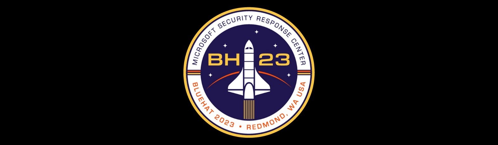

# Bluehat 2023 - Post-Quantum Cryptography Village

<picture>
 <source media="(prefers-color-scheme: dark)" srcset="img/bh.jpg">
 <source media="(prefers-color-scheme: light)" srcset="img/bh.jpg">
 
</picture>

Welcome to the Post-Quantum Cryptography (PQC) BlueHat village. We’re excited to share with you news and resources with regards to staying quantum safe! Come talk to us in our booth in the village room in Building 92 (Normandy/Nexus rooms), attend one of our presentations, try one of our challenges, and learn more about PQC using the information on this page.

## What is Post-Quantum Cryptography?

Post-Quantum Cryptography (PQC), a.k.a., Quantum-Safe Cryptography consists of all cryptographic algorithms that are not vulnerable to quantum computers. Today’s asymmetric cryptography is vulnerable to Shor’s algorithm, a quantum attack that could break the encryption and forge signatures in standards such as TLS, SSH, X.509. Why should we care now when quantum computers won’t become a reality for many years? Well, encrypted data can be recorded today and decrypted later. Do you have secrets that should stay secret for more than 10 years? If so, the current cryptography protecting them is not sufficient!

The research community started work to find alternative schemes that aren’t vulnerable to quantum attacks, and after many years of research and development, the National Institute of Standards and Technology (NIST) selected a first set of algorithms to standardize.
These new algorithms will make their way in security standards, internet protocols, and cryptographic libraries. It is important to get familiar with them, because they perform differently than today’s elliptic curve based algorithms and RSA; they have bigger keys, bigger ciphertexts and signatures, and are slower. It is important to start learning about and experimenting with these algorithms to have a successful transition to a post-quantum world.

## Village Schedule

* Wed Feb 8th 3pm: +++ TODO +++
* Wed Feb 8th 3:15pm: +++ TODO +++
* Thu Feb 9th 3pm: +++ TODO +++
* Thu Feb 9th 3:15pm: +++ TODO +++
* Fri Feb 10th 3pm: +++ TODO +++
* Fri Feb 10th 3:15pm: +++ TODO +++

Drop by the booth at any time to discuss PQC!

## Resources

* Learn more about the [PQC standardization effort](https://csrc.nist.gov/projects/post-quantum-cryptography) by the National Institute of Standards and Technology (NIST), including the [first selected PQC algorithms](https://csrc.nist.gov/Projects/post-quantum-cryptography/selected-algorithms-2022).
* Learn how to scan quantum vulnerable code using [CodeQL](https://codeql.github.com/) (using proof-of-concept [queries](https://github.com/raulgarciamsft/ql/tree/main/cpp/ql/src/experimental/campaigns/nccoe-pqc-migration/QuantumVulnerableDiscovery/WinCng)).
* Learn more about [quantum computing](http://microsoft.com/quantum).
* Start experimenting with PQC using the [Open Quantum Safe project](https://openquantumsafe.org/).
